# Android Intent Exercise Demos

This repository contains implementations of various Android Intent exercises demonstrating different ways to handle Intents in Android applications.

## Exercise 6: Starting Activities (Explicit Intents)

This exercise demonstrates the usage of explicit intents for activity navigation and data passing between activities.

| Screen | Description | Screenshot Reference |
|--------|-------------|---------------------|
| Main Screen | Shows an EditText field and "Exercise 6" button | 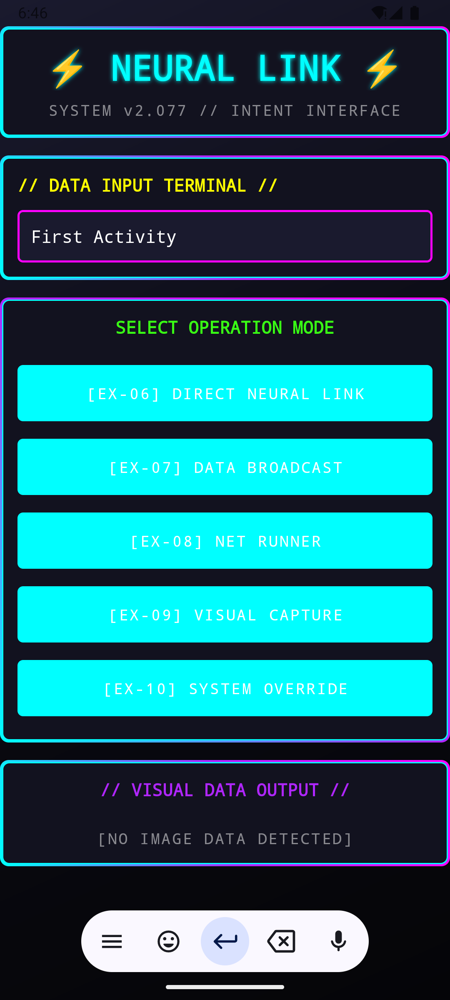 |
| Result Activity | Displays received data and return value input | 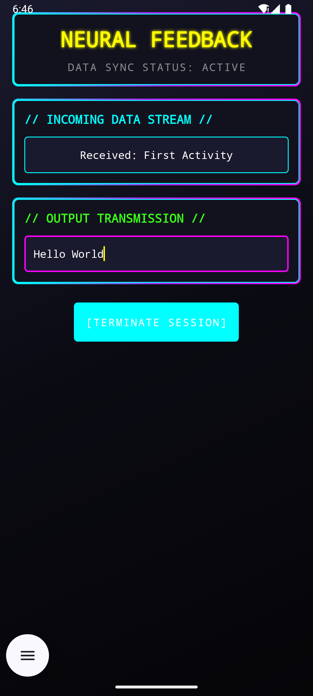 |
| Return Toast | Shows the returned data in a toast message | 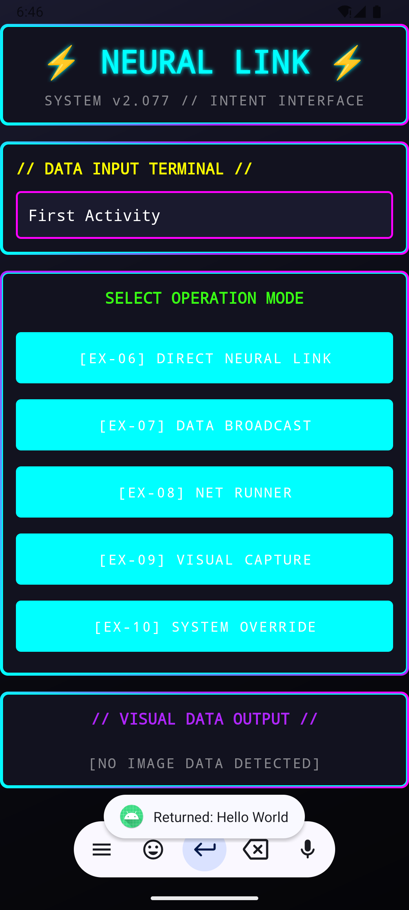 |

## Exercise 7: Using the Share Intent

Demonstrates how to implement sharing functionality and receive shared content from other apps.

| Screen | Description | Screenshot Reference |
|--------|-------------|---------------------|
| Share Dialog | System share dialog with available apps | 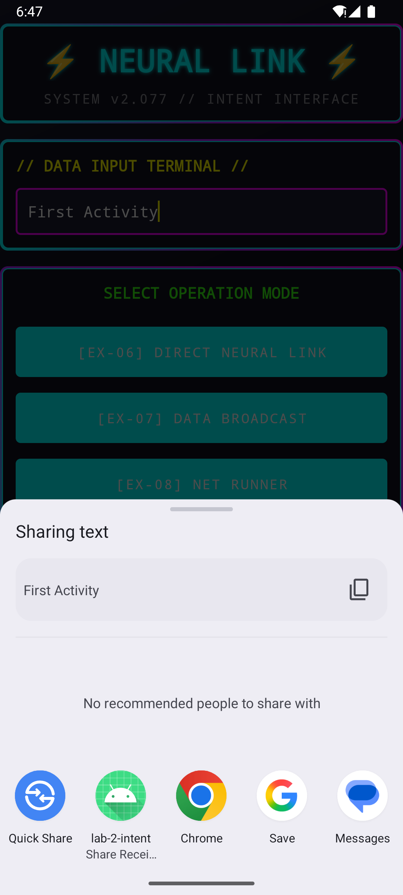 |
| Share Activity | Our app receiving shared content | 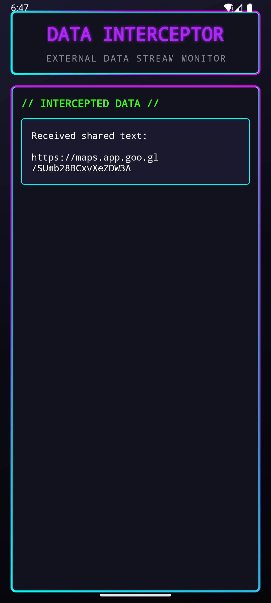 |

## Exercise 8: Register an Activity as Browser

Shows how to implement a custom browser activity that can handle HTTP URLs.

| Screen | Description | Screenshot Reference |
|--------|-------------|---------------------|
| Browser Selection | System browser chooser dialog | 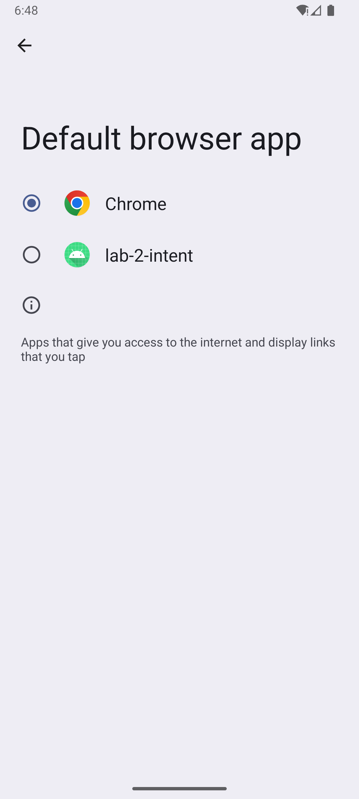 |
| Custom Browser | Our app displaying HTML content | 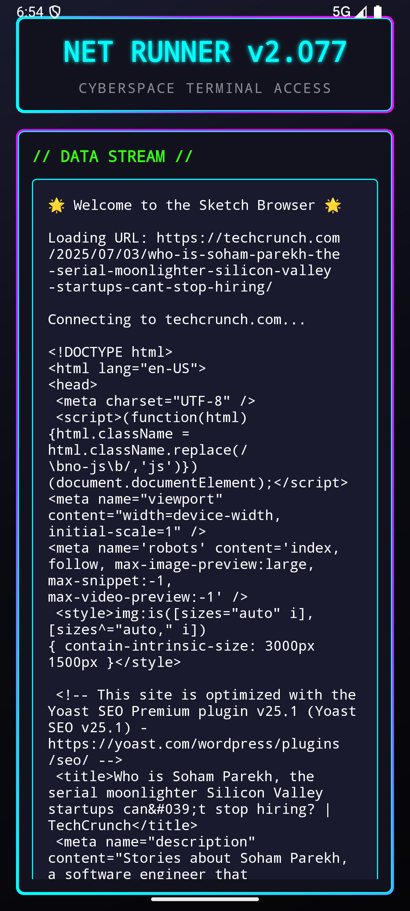 |

## Exercise 9: Picking an Image via an Intent

Demonstrates how to use the system image picker and display selected images.

| Screen | Description | Screenshot Reference |
|--------|-------------|---------------------|
| Image Picker | System image picker dialog | 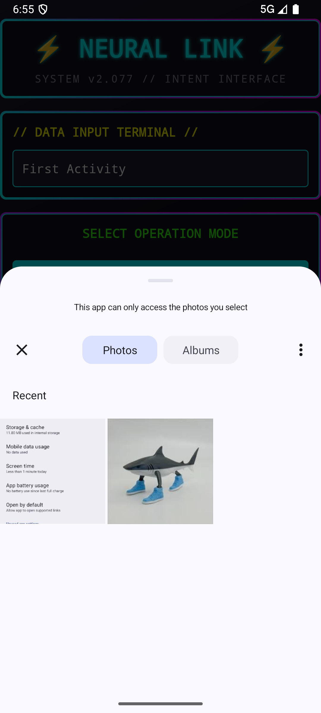 |
| Selected Image | Main screen showing selected image | 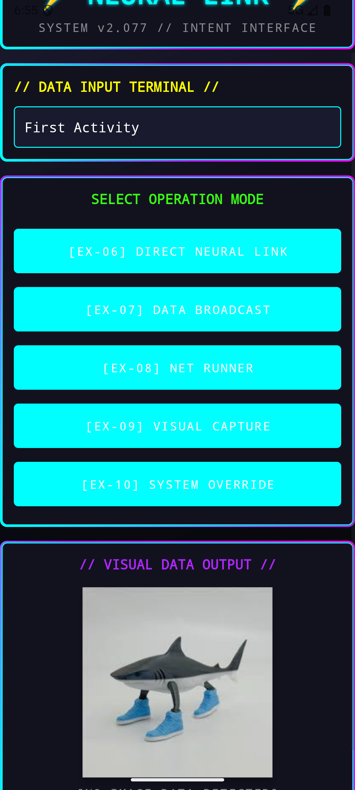 |

## Exercise 10: Using Different Implicit Intents

Showcases various implicit intents for common system actions.

| Screen | Description | Screenshot Reference |
|--------|-------------|---------------------|
| Intent Selection | Spinner with different intent options | 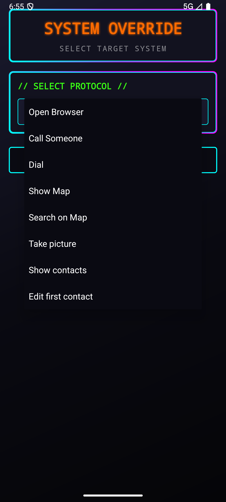 |
| Browser Intent | Browser opening vogella.com |  |
| Dialer Intent | Phone dialer with pre-filled number | 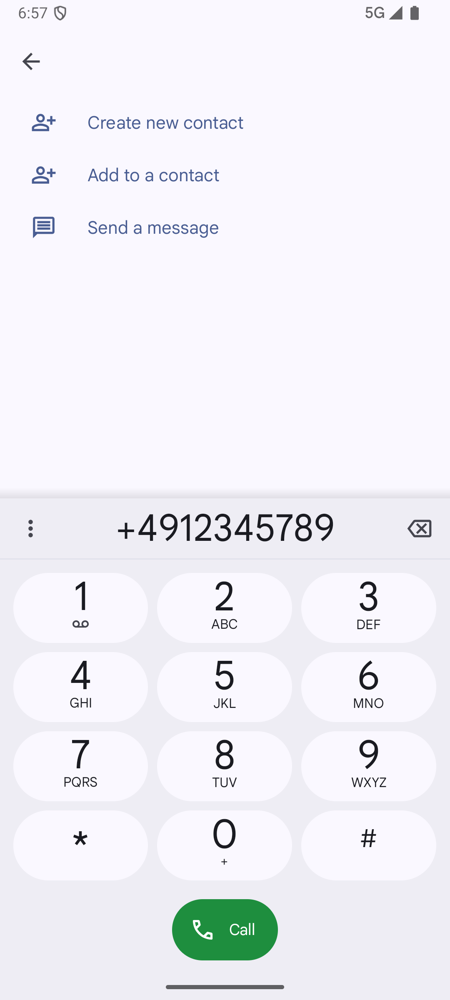 |
| Map Intent | Maps app showing coordinates | 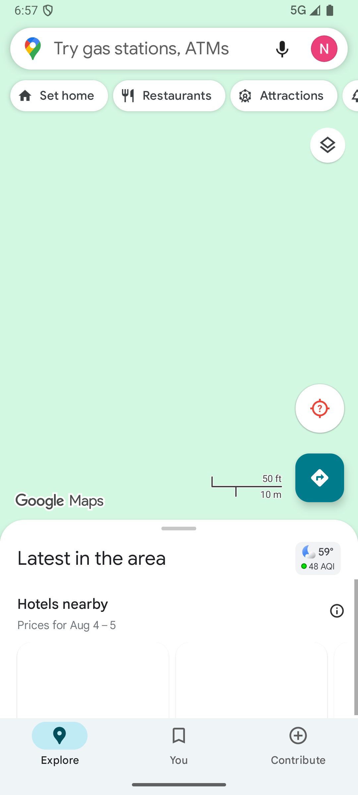 |
| Camera Intent | Camera app in photo capture mode | 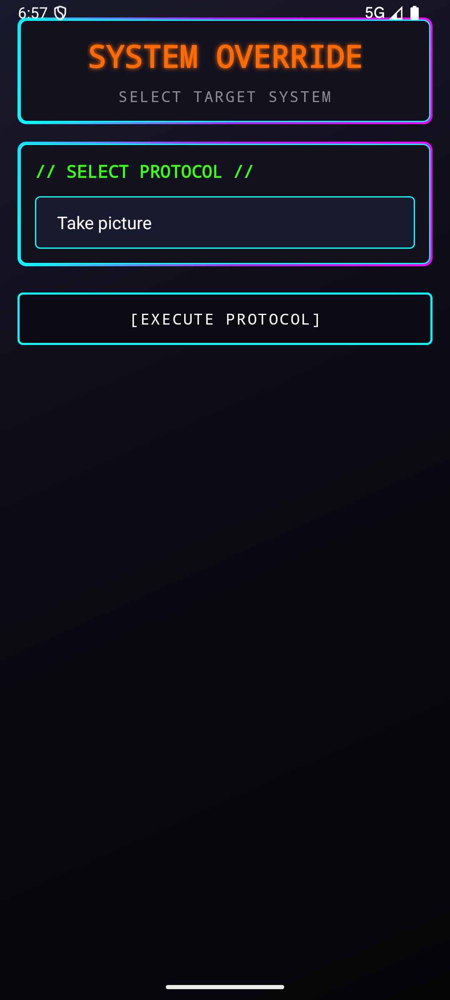 |
| Contacts Intent | Contacts app display | 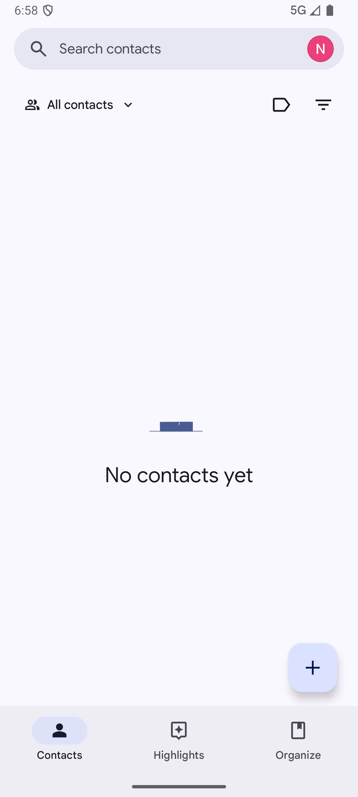 |