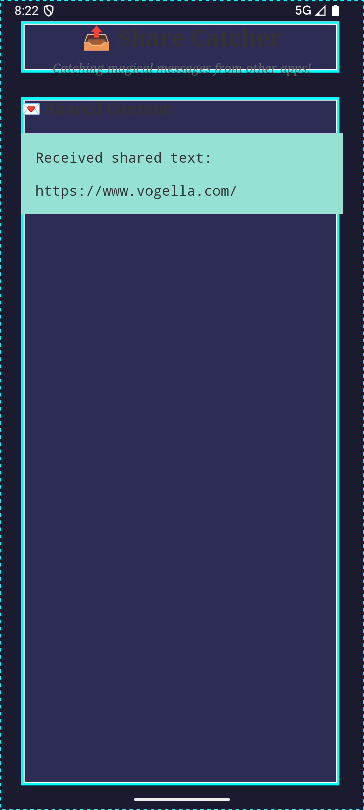
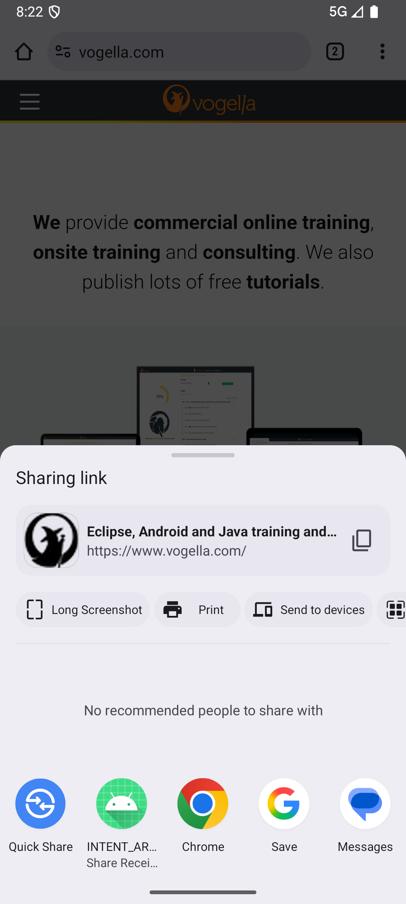
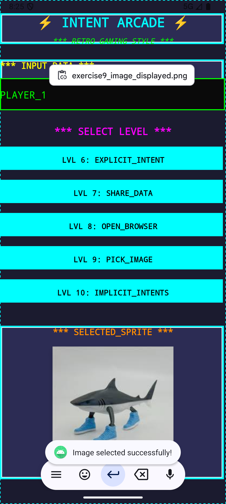

# Android Intent Exercises - Complete Implementation

This project demonstrates comprehensive Android Intent usage through practical exercises, showcasing both explicit and implicit intents, activity communication, and system integration.

## Technology Stack
- **Platform**: Android (Java)
- **Build System**: Gradle with Kotlin DSL
- **Minimum SDK**: Android API Level (check build.gradle)
- **Target Concepts**: Android Intents, Activity Lifecycle, System Integration

---

## Exercise Overview

### Main Application Interface

*The main screen showing all available exercise buttons*

---

## Exercise 6: Starting Activities (Explicit Intents)

### Technology Used:
- **Explicit Intents** with `Intent(this, TargetActivity.class)`
- **Data Transfer** using `putExtra()` and `getExtras()`
- **Activity Results** with `startActivityForResult()` and `onActivityResult()`
- **Toast Notifications** for user feedback

### Demonstration:

*Main screen with text input ready for Exercise 6*

*ResultActivity displaying received data and providing input for return value*

*Toast notification showing successfully returned data*

### What This Exercise Shows:
- Creating explicit intents to start specific activities
- Passing data between activities using intent extras
- Implementing bidirectional communication between activities
- Handling activity results and user feedback

---

## Exercise 7: Using the Share Intent

### Technology Used:
- **Implicit Intents** with `ACTION_SEND`
- **Intent Filters** in AndroidManifest.xml
- **MIME Type Handling** (`text/plain`)
- **Intent Chooser** for better user experience
- **System Integration** for receiving shared content

### Demonstration:

*Android share chooser showing available apps for sharing*

*ShareActivity displaying content received from another app*

*Our app appearing in share options when sharing from another app*

### What This Exercise Shows:
- Sending data to other apps using share intents
- Registering as a share target for other applications
- Handling received shared content
- System-wide app integration

---

## Exercise 8: Register an Activity as Browser

### Technology Used:
- **Intent Filters** for `ACTION_VIEW` with HTTP scheme
- **URL Handling** and custom browser implementation
- **Network Operations** with proper permissions
- **HTML Content Processing** and display
- **System Browser Integration**

### Demonstration:

*System showing browser options including our custom browser*

*Our BrowserActivity displaying raw HTML content*

*Standard browser opened via intent from our app*

### What This Exercise Shows:
- Registering as a system component (browser)
- Handling URL intents and schemes
- Custom browser implementation
- Network permissions and operations

---

## Exercise 9: Picking an Image via an Intent

### Technology Used:
- **ActivityResultLauncher** (modern approach replacing startActivityForResult)
- **Content Provider Access** using `ACTION_GET_CONTENT`
- **Image Processing** with BitmapFactory
- **File URI Handling** and stream processing
- **MIME Type Filtering** for images

### Demonstration:

*System image picker dialog showing available image sources*

*Selected image displayed in the app with success message*

*Gallery interface during image selection process*

### What This Exercise Shows:
- Modern ActivityResultLauncher API usage
- Content URI handling and file access
- Image processing and display optimization
- User-friendly file selection interface

---

## Exercise 10: Using Different Implicit Intents

### Technology Used:
- **Multiple Implicit Intent Types** (8 different system actions)
- **Spinner UI Component** for intent selection
- **System Permissions** (CALL_PHONE, etc.)
- **URI Scheme Handling** (tel:, geo:, content:)
- **Error Handling** for missing system components

### Available Intent Types:
1. **Open Browser** - Launch web browser with URL
2. **Call Someone** - Direct phone call (requires permission)
3. **Dial** - Open dialer with pre-filled number
4. **Show Map** - Display location on map
5. **Search on Map** - Perform location search
6. **Take Picture** - Launch camera app
7. **Show Contacts** - Open contacts list
8. **Edit First Contact** - Open contact editor

### Demonstration:

*Spinner dropdown showing all available intent types*

*Phone dialer opened via intent with pre-filled number*

*Maps app showing location via geo intent*

*Camera app launched via intent for photo capture*

### What This Exercise Shows:
- Comprehensive implicit intent usage patterns
- System service integration (phone, maps, camera, contacts)
- Permission handling for privileged operations
- Error handling and user experience considerations

---

## Key Features & Modern Practices

### Architecture Highlights:
- ✅ **Modern APIs**: Uses ActivityResultLauncher instead of deprecated methods
- ✅ **Proper Permissions**: Correct manifest declarations and runtime handling
- ✅ **Error Handling**: Graceful handling of missing apps or denied permissions
- ✅ **User Feedback**: Toast messages and visual feedback for all operations
- ✅ **Material Design**: Clean, modern Android UI components

### System Integration:
- 📱 **Share Target**: App can receive shared content from other applications
- 🌐 **Custom Browser**: Can handle HTTP URLs as alternative browser
- 📷 **File Access**: Secure image selection from device storage
- 📞 **System Services**: Integration with phone, maps, camera, and contacts

## Installation & Testing

1. **Clone** this repository
2. **Open** in Android Studio
3. **Build** and install on Android device/emulator
4. **Grant permissions** when prompted during testing
5. **Test each exercise** following the demonstration flows above

## Learning Objectives Achieved

Through this implementation, you'll understand:
- **Explicit vs Implicit Intents** and when to use each
- **Activity Communication** and data transfer patterns
- **System Integration** and becoming part of Android's app ecosystem
- **Modern Android Development** practices and APIs
- **User Experience** considerations in mobile app development

---

*This project serves as a comprehensive reference for Android Intent usage, demonstrating real-world integration patterns that every Android developer should understand.*
