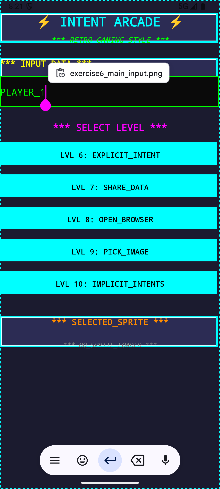
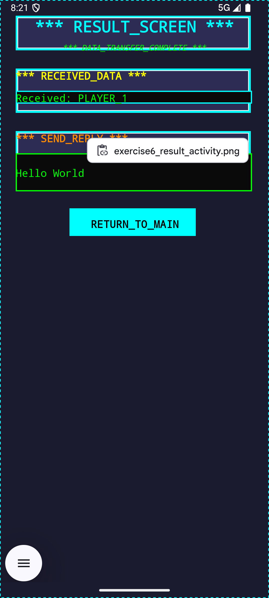
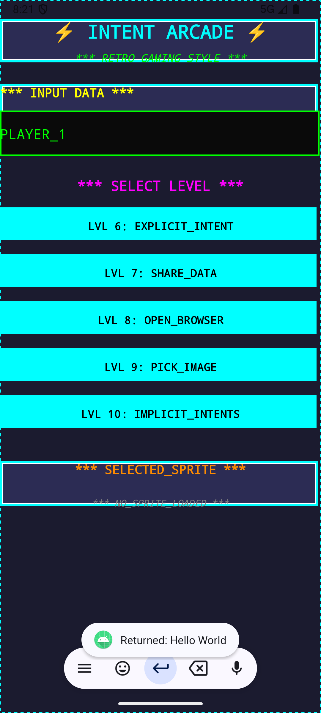
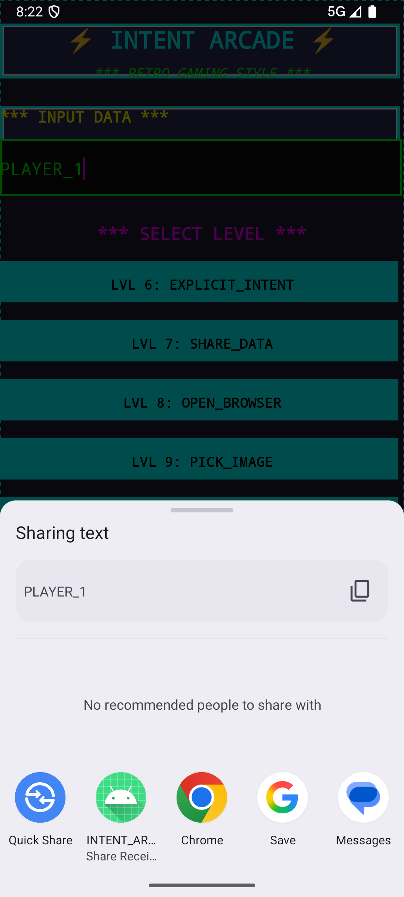
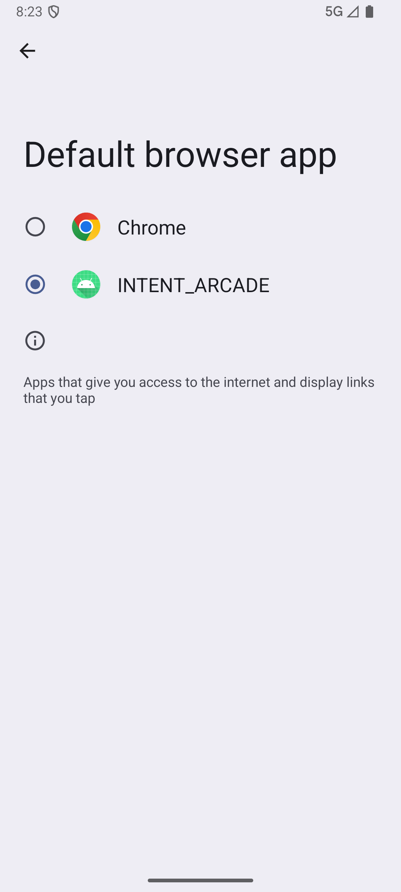
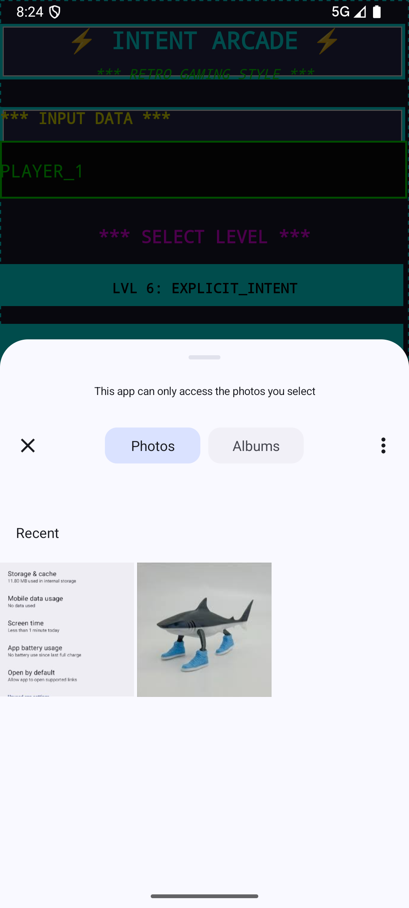
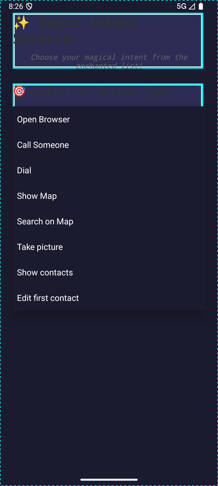

# Android Intent Exercises

## Exercise 6: Starting Activities (Explicit Intents)

| Description | Screenshot |
|-------------|------------|
| Main screen with text input field and Exercise 6 button |  |
| ResultActivity displaying received data and providing input for return value |  |
| Toast notification showing successfully returned data |  |

## Exercise 7: Using the Share Intent

| Description | Screenshot |
|-------------|------------|
| Android share chooser showing available apps for sharing |  |
| ShareActivity displaying content received from another app |  |
| Our app appearing in share options when sharing from another app |  |

## Exercise 8: Register an Activity as Browser

| Description | Screenshot |
|-------------|------------|
| System showing browser options including our custom browser |  |
| Our BrowserActivity displaying raw HTML content |  |
| Standard browser opened via intent from our app |  |

## Exercise 9: Picking an Image via an Intent

| Description | Screenshot |
|-------------|------------|
| System image picker dialog showing available image sources |  |
| Selected image displayed in the app with success message |  |
| Gallery interface during image selection process |  |

## Exercise 10: Using Different Implicit Intents

| Description | Screenshot |
|-------------|------------|
| Spinner dropdown showing all available intent types |  |
| Phone dialer opened via intent with pre-filled number |  |
| Maps app showing location via geo intent |  |
| Camera app launched via intent for photo capture |  |
